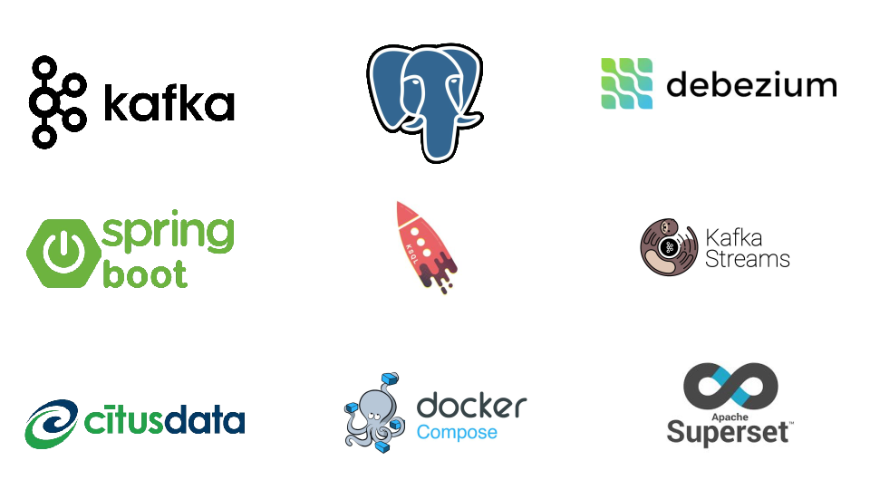

# adii-training


# Requeriments
- `Docker (to build the associated infrastructure)`
- `JDK 11+`
- `Docker-compose`
- `Apache maven 3 +`

# Structure du projet


```
apps/                           #  <-- l 'ensemble des apps des labs                        
 
    kafka/
        producer/               #  <-- projet microservice springboot pour le producer
               
        consumer/               #  <-- projet microservice springboot pour le consumer
    ksql/
        datagen/                #  <--  projet microservice springboot pour le generateur des
                                # données pour ksql
               
    kstream    
          domain-crawler       #  <-- projet microservice springboot pour le web domains crawler
          domain-processor     #  <-- projet microservice springboot pour le web domains processor
          domain-service       #  <-- projet microservice springboot pour le web domains service

demo
   linux                       #  <--script d 'instialisation et de destruction de la platfomre sous linux
   windows                     #  <--script d 'instialisation et de destruction de la platfomre sous windows
platform
     connectors                #  <-- connecteurs pour le projet
     docker                    #  <--  script de creation de la base de test postgrsql
     init
     k8s                       #  <--  script kubernetes et kafka strimzi  pour l 'initialisation de la plaform
     docker-compose.yml        #  <-- fichier  docker compose pour la creation et l 'initialisation des
                               #  outils pour le projet


```

#  L' execution des labs
Les détails pour exécuter les labs de la  formation proposée  sont expliqués ci-dessous.

# Build de l'environment
Tout d'abord, nous construisons l'infrastructure qui nous permet de simuler les cas d'utilisation défini.

- `Zookeeper`
- `Kafka`
- `Kafka UI: To check data`
- `Kafka Connect`
- `Schema Registry`
- `les codes sources des projets springboot`
- `citus`
- `postgresql`
- `Apache superset`

 
  Le fichier hosts permet de faire correspondre les noms d'hôtes aux adresses IP. C'est très important dans 
  certaines configurations et pour rendre la mise en réseau sous Linux ou windows. Dans un sens, le fichier hosts agit 
  comme un serveur DNS local.ajoutez y cette entrée.

- `127.0.0.1       broker`

# Processus d'ingestion : Processus qui simule l'ingestion des mouvements dans les topics Kafka.

Pour cela, vous devez exécuter le script :
```shell
user@machine:~$ sh demo/1-init.sh
```
#  Check health

```shell
docker-compose ps
```

# Generation des données
Il est nécessaire de générer des données fictives pour tester les solutions proposées, 
l'étape suivante consistera donc à lancer un processus qui  ingeste des mouvements de toutes sortes dans les topics Kafka.


## lancez kafka app (consumer)
```shell
user@machine:~$ cd "$APPS/kafka/consumer"
user@machine:~$ mvn clean  install -DskipTests
```
## lancez kafka app (producer)
```shell
user@machine:~$ cd "$APPS/kafka/producer"
user@machine:~$ mvn clean  install -DskipTests
```


## lancez le domain-crawler kstream
```shell
user@machine:~$ cd "$APPS/kstream/domain-crawler"
user@machine:~$ java -jar target/domain-crawler-0.0.1-SNAPSHOT.jar
```
## lancez le kstream domain-processor
```shell
user@machine:~$cd "$APPS/kstream/domain-processor"
user@machine:~$ java -jar target/domain-processor-0.0.1-SNAPSHOT.jar
```


## lancez le kstream domain-service
```shell
user@machine:~$cd "$APPS/kstream/domain-service"
user@machine:~$ java -jar target/domain-service-0.0.1-SNAPSHOT.jar
```
## lancez le ksql datagen
```shell
user@machine:~$cd "$APPS/ksql/datagen"
user@machine:~$  java -jar target/fraud-checker-kstreams-0.0.1-SNAPSHOT.jar
```


Une fois que cela est fait, les processus sont en cours d'exécution et surveille tous les
mouvements.

## Analyse des results
Enfin, vous pouvez vérifier le fonctionnement du processus en accédant à Kafka UI,
en vérifiant les différents sujets.

http://localhost:9081/ui/clusters/local/topics/movements


Avec cela, vous avez déjà tous les outils pour jouer avec kafka.
Profitez-en !

## Détruisez l' environment
Enfin, pour détruire l'environnement, il suffit d'exécuter le script suivant :

user@machine:~$ sh demo/linux/3-stop.sh

## Documentation pour les projets sous jacents
- lab [kafka microservices consumer](/doc/README-consumer.md)
- lab [kafka microservices producer](/doc/README-producer.md)
- lab [kstream](/doc/README-kstream.md)
- lab [ksql](/doc/README-ksql.md)