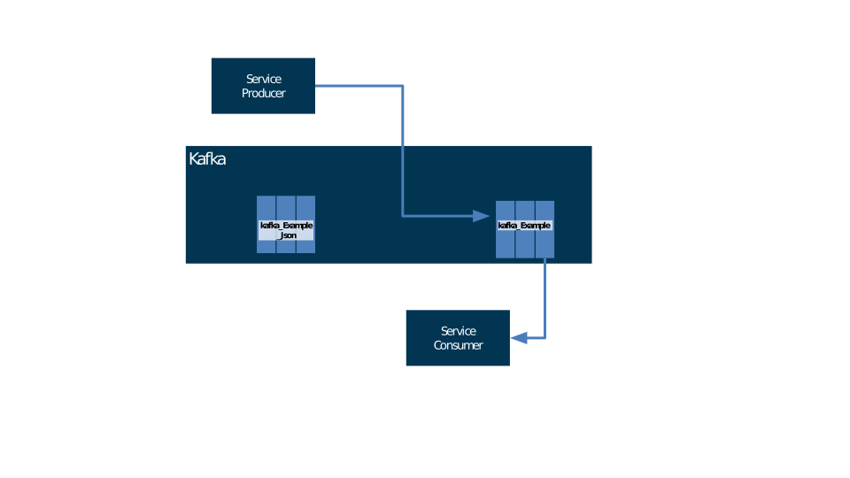

# Spring Boot avec Kafka Producer microservice

Ce projet couvre l'utilisation de Spring Boot avec Spring Kafka pour publier des messages JSON/String vers un sujet Kafka.

## Consommer à partir du sujet Kafka via la console
-  `docker exec -it broker sh`
-  `cd /bin`
- `./kafka-console-consumer.sh --bootstrap-server localhost:9092 --topic Kafka_Example --from-beginning`

## Publiez un message avec un service Rest
- `http://localhost:8081/kafka/publish/Sam`
- `http://localhost:8081/kafka/publish/Holmes`
