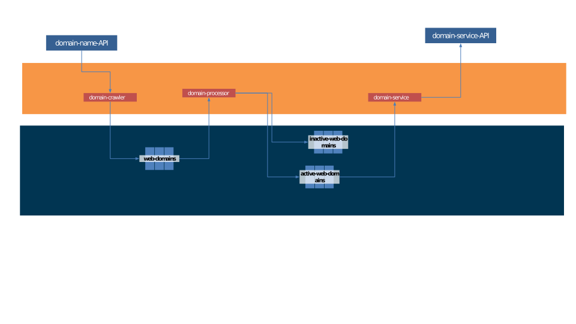

# Spring Kafka Streams using Spring Cloud Streams

Dans cet article, nous allons voir comment configurer Kafka Streams à l'aide de Spring Boot.
Kafka Streams est une bibliothèque côté client construite au-dessus d'Apache Kafka. 
Elle permet le traitement d'un flux non limité d'événements de manière déclarative.

Les données de capteurs, les flux d'événements boursiers et les journaux système sont des
exemples concrets de données en continu. 

Pour ce tutoriel, nous allons construire une 
application de streaming simple de crawling des domaines web active. 

## Microservices
- 'domain-crawler' - uses Spring Kafka
- 'domain-processor' - uses Spring Cloud Stream with Kafka Streams binder
- 'domain-service' - uses Spring Cloud Stream with Kafka Streams binder

## Endpoint
- http://localhost:8080/domain/lookup/facebook - to pull all facebook related web domain names
